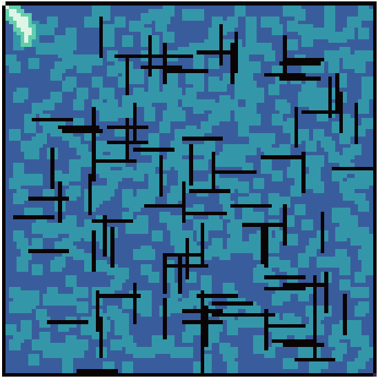

# A* Pathfinding, AI Project

Developed by:

-   Tiago Matos
-   Paulo Pinto

This project implements the A* algorithm to find the best path through a square map with different terrain restrictions.

## Solve

  

